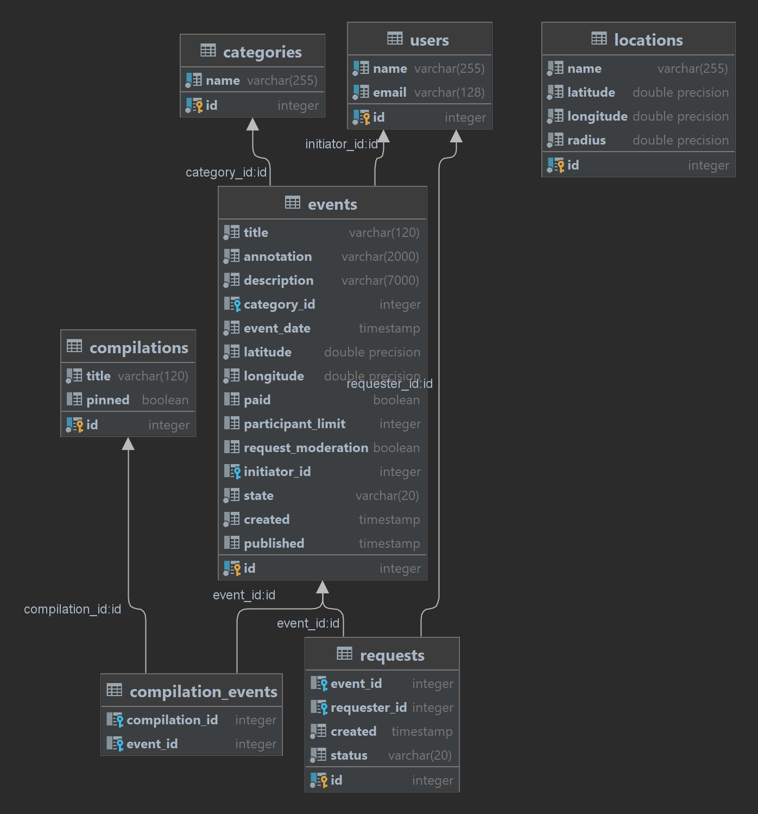
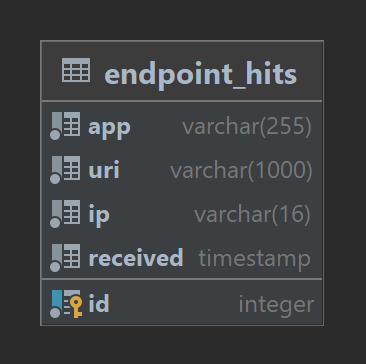

# Explore-with-me

### (Дипломный проект по курсу «Java-разработчик» Яндекс.Практикума)

Приложение предназначено для того, чтобы делиться информацией об интересных событиях и помогать найти компанию
для участия в них.

Проект построен на SpringBoot и реализует микросервисную архитектуру. Сервисы приложения и базы данных запускаются в
docker-контейнерах.

Технологический стек:
**Java 11, Spring Boot, PostgreSQL, Hibernate, microservices, Docker, Feign, QueryDSL**

Приложение включает два сервиса.
* Основной сервис — содержит всё необходимое для работы продукта.
* Сервис статистики — хранит количество просмотров и позволяет делать различные выборки для анализа работы приложения.

Каждый сервис использует собственную базу данных.

### Спецификация API в Swagger
* спецификация основного сервиса:
  [ewm-main-service-spec.json](https://raw.githubusercontent.com/yandex-praktikum/java-explore-with-me/main/ewm-main-service-spec.json)
* спецификация сервиса статистики:
  [ewm-stats-service.json](https://raw.githubusercontent.com/yandex-praktikum/java-explore-with-me/main/ewm-stats-service-spec.json)

### Функционал основного сервиса

API основного сервиса разделён на три части. Первая — публичная, доступна без регистрации любому пользователю сети.
Вторая — закрытая, доступна только авторизованным пользователям.
Третья — административная, для администраторов сервиса. (Сервис авторизации в данном проекте не реализован.)

#### Публичный API
Публичный API предоставляет возможности поиска и фильтрации событий.
1. Сортировка списка событий организована либо по количеству просмотров, которое запрашивается в сервисе статистики, 
либо по датам событий.
2. При просмотре списка событий возвращается только краткая информация о мероприятиях.
3. Просмотр подробной информации о конкретном событии осуществляется через отдельный эндпоинт.
4. Имеется возможность получения всех имеющихся категорий и подборок событий
(которые составляют администраторы ресурса).
5. Каждый публичный запрос для получения списка событий или полной информации о мероприятии фиксируется сервисом 
статистики.

#### API для авторизованных пользователей
1. Возможность добавлять в приложение новые мероприятия, редактировать их и просматривать после добавления.
2. Подача заявок на участие в интересующих мероприятиях.
3. Создатель мероприятия может подтверждать заявки, которые отправили другие пользователи сервиса.

#### API для администратора
1. Добавление, изменение и удаление категорий для событий.
2. Возможность добавлять, удалять и закреплять на главной странице подборки мероприятий.
3. Модерация событий, размещённых пользователями — публикация или отклонение.
4. Управление пользователями — добавление, просмотр и удаление.

### Функционал сервиса статистики
1. Запись информации о том, что был обработан запрос к эндпоинту API.
2. Предоставление статистики за выбранные даты по выбранному эндпоинту.

### Дополнительная функциональность основного сервиса — локации

В качестве дополнительной функциональности, расширяющей требования ТЗ, реализованы **Локации**.
1. Возможность для администратора добавлять, изменять, удалять конкретные локации —
  города, театры, концертные залы и другие в виде координат (широта, долгота, радиус).
2. Получение списка этих локаций — для администратора и через публичный API.
3. Просмотр информации о локации — для администратора и через публичный API.
4. Возможность поиска событий, которые будут происходить внутри конкретной локации 
(для администратора и через публичный API — c разным набором атрибутов события, аналогично поиску событий 
в основном функционале).

При использовании поиска событий внутри локации хотелось сохранить возможность фильтрации событий
по тем же критериям, что были даны в спецификации API для простого поиска событий.

В коде основной функциональности фильтрация была реализована с помощью предикатов *QueryDSL*.
В сервисах поиска по локациям продублирована та же логика, но дополнительно использован *QueryDSL* предикат,
построенный на пользовательской SQL-функции *distance* (реализация выполнена согласно статье
[«Register custom or non-standard SQL functions in Spring Boot JPA or Query DSL](https://medium.com/codex/register-custom-or-non-standard-sql-functions-in-spring-boot-jpa-or-query-dsl-34980fb42cf1))

### Схема базы данных основного сервиса

### Схема базы данных сервера статистики:

